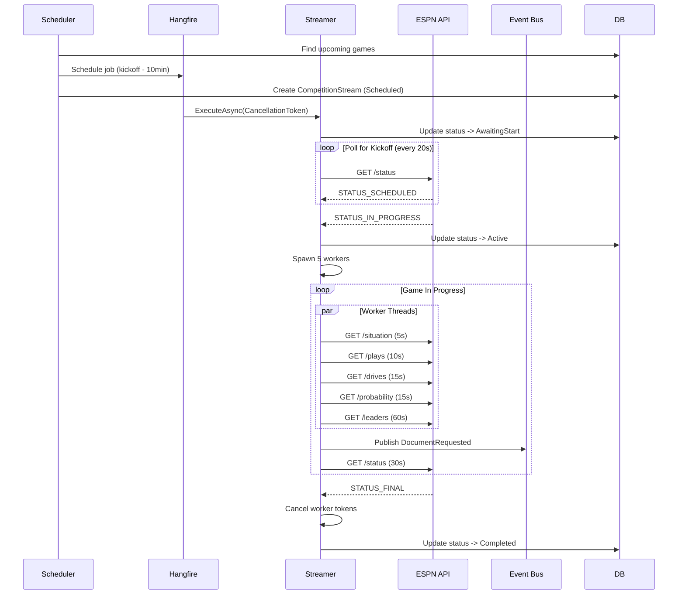
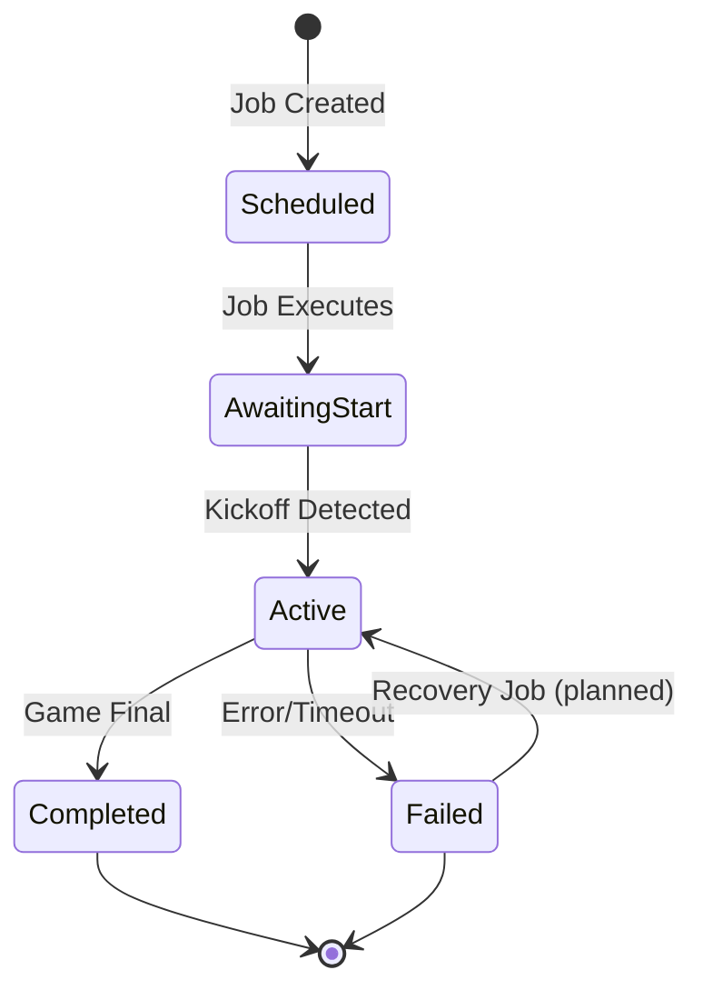
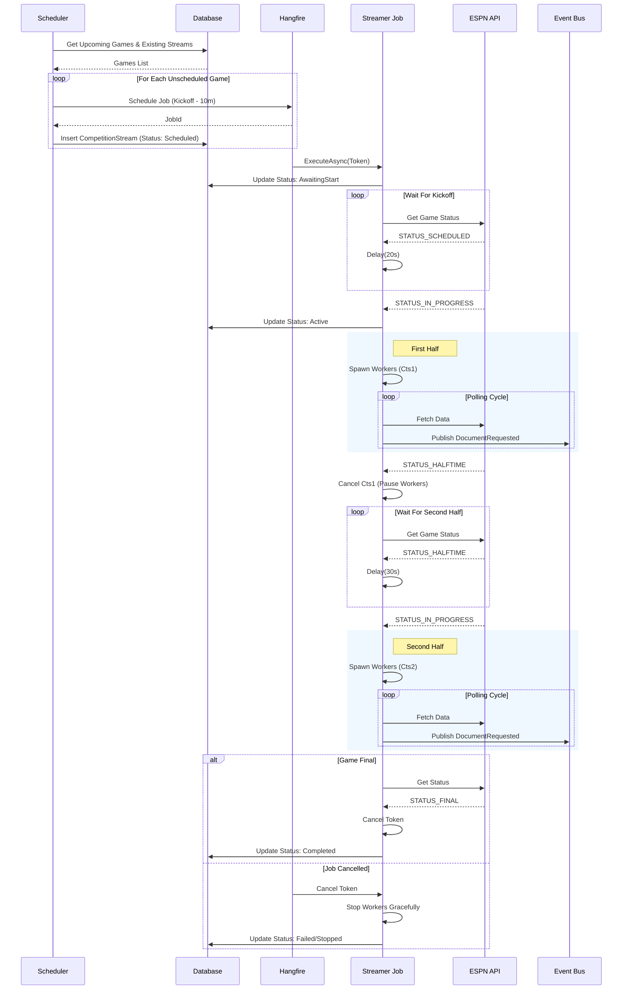

# Live Game Streaming

The `FootballCompetitionStreamer` system provides real-time updates during live football games by polling ESPN's API for game state, spawning workers to fetch different data types, publishing events to downstream processors, and tracking stream lifecycle in the database. Combines `LiveGameStreaming-Complete.md` (Phase 1 completion summary) and `LIVE_UPDATES_REFACTORING.md` (forward-looking refactoring plan), previously separate root-level docs. Reorganized around a "Phase 1 (shipped)" / "Phase 2+ (planned)" timeline.

## Table of Contents

1. [Overview](#overview)
2. [Architecture](#architecture)
3. [Phase 1 — Shipped](#phase-1--shipped)
4. [Phase 2 and beyond — Planned](#phase-2-and-beyond--planned)
5. [Testing Strategy](#testing-strategy)
6. [Quick Start Guide](#quick-start-guide)
7. [Troubleshooting](#troubleshooting)

---

## Overview

### What is Live Game Streaming?

The streamer polls ESPN's API for game status changes, spawns workers to fetch different types of game data, publishes events to downstream processors, and tracks stream lifecycle and health.

### Key Components

```
FootballCompetitionStreamScheduler  -> Schedules streams 10min before kickoff
         |
FootballCompetitionStreamer         -> Manages game streaming lifecycle
         |
Document Processors                 -> Process ESPN data & update database
         |
Event Publishers                    -> Notify downstream systems (API, Notifications)
```

### Status Summary

- **Phase 1 (shipped):** Cancellation, worker lifecycle, status tracking, graceful shutdown, safety timeouts, integration tests.
- **Phase 2+ (planned):** Halftime pause/resume, error recovery, observability metrics, contest-event collapse.

---

## Architecture

### Streaming Lifecycle (high level)



### Worker Polling Intervals

| Document Type | Interval | Priority | Purpose |
|---------------|----------|----------|---------|
| `EventCompetitionSituation` | 5s | High | Down/distance, possession, clock |
| `EventCompetitionPlay` | 10s | High | Play-by-play updates |
| `EventCompetitionDrive` | 15s | Medium | Drive summaries |
| `EventCompetitionProbability` | 15s | Medium | Win probability |
| `EventCompetitionLeaders` | 60s | Low | Statistical leaders |

### Stream Status State Machine



### Detailed Streaming Lifecycle (with halftime branch)



---

## Phase 1 — Shipped

Phase 1 closed the critical issues that prevented the streamer from running unattended. The four problems below were all RESOLVED before the 2025 season.

### What Exists

**`FootballCompetitionStreamScheduler`** (`src/SportsData.Producer/Application/Competitions/FootballCompetitionStreamScheduler.cs`)

- Queries current season week to find upcoming games
- Schedules streaming jobs 10 minutes before kickoff
- Creates `CompetitionStream` tracking records
- Integrates with Hangfire for background job orchestration

```csharp
public async Task Execute()
{
    var seasonWeek = await _dataContext.SeasonWeeks
        .Where(sw => sw.StartDate <= DateTime.UtcNow && sw.EndDate >= DateTime.UtcNow)
        .FirstOrDefaultAsync();

    // Schedules job 10 minutes before game time
    var scheduledTimeUtc = competition.Date - TimeSpan.FromMinutes(10);

    var jobId = _backgroundJobProvider.Schedule<IFootballCompetitionBroadcastingJob>(
        job => job.ExecuteAsync(new StreamFootballCompetitionCommand { ... }),
        scheduledTimeUtc - DateTime.UtcNow);
}
```

**`FootballCompetitionStreamer`**

- Implements `IFootballCompetitionBroadcastingJob`
- Polls ESPN status endpoint to detect game state changes
- Spawns polling workers for different data types
- Monitors for game completion

Key methods:
- `WaitForKickoffAsync()` — polls every 20s until game starts
- `StartPollingWorkers()` — spawns 5 concurrent workers
- `PollWhileInProgressAsync()` — monitors status every 30s
- `PublishDocumentRequestAsync()` — requests document updates

**`CompetitionStream` Entity**

```csharp
public class CompetitionStream
{
    public Guid CompetitionId { get; set; }
    public DateTime ScheduledTimeUtc { get; set; }
    public string BackgroundJobId { get; set; }
    public CompetitionStreamStatus Status { get; set; }
    public DateTime? StreamStartedUtc { get; set; }
    public DateTime? StreamEndedUtc { get; set; }
    public string? FailureReason { get; set; }
    public int RetryCount { get; set; }
}

public enum CompetitionStreamStatus
{
    Scheduled = 0,
    AwaitingStart = 1,
    Active = 2,
    Completed = 3,
    Failed = 4
}
```

**Document Processors (handling live updates)**

- `EventCompetitionStatusDocumentProcessor` — Game status (quarter, clock, final)
- `EventCompetitionPlayDocumentProcessor` — Individual plays
- `EventCompetitionSituationDocumentProcessor` — Current game situation
- `EventCompetitionProbabilityDocumentProcessor` — Win probability
- `EventCompetitionDriveDocumentProcessor` — Drive summaries
- `EventCompetitionLeadersDocumentProcessor` — Statistical leaders
- `EventCompetitionCompetitorDocumentProcessor` — Competitor updates
- `EventCompetitionCompetitorLineScoreDocumentProcessor` — Quarter scores

### Event Publishing — Lifecycle vs. Scoreboard Split (2026-05-03)

`ContestStatusChanged` was narrowed to a sport-neutral lifecycle event; the football scoreboard fields it used to carry moved to a sport-specific tick event. See [INTEGRATION_EVENTS.md](../INTEGRATION_EVENTS.md).

```csharp
// Sport-neutral lifecycle (Scheduled -> InProgress -> Final)
public record ContestStatusChanged(
    Guid ContestId,
    string Status,
    Uri? Ref,
    Sport Sport,
    int? SeasonYear,
    Guid CorrelationId,
    Guid CausationId);

// Football per-play scoreboard tick
public record FootballContestStateChanged(
    Guid ContestId,
    string Period,
    string Clock,
    int AwayScore,
    int HomeScore,
    Guid? PossessionFranchiseSeasonId,
    bool IsScoringPlay,
    Uri? Ref,
    Sport Sport,
    int? SeasonYear,
    Guid CorrelationId,
    Guid CausationId);
```

Proof it works:

- `EventCompetitionPlayDocumentProcessor` (FB) emits both `ContestPlayCompleted` (log) and `FootballContestStateChanged` (scoreboard) when a play lands on a live contest.
- `ContestReplayService` emits the lifecycle once and a state-changed event per play; matches the live-flow shape exactly.

### Issue #1: Infinite Polling Workers (Memory Leak) — RESOLVED

**Severity:** Critical | **Status:** RESOLVED — now uses `while (!cancellationToken.IsCancellationRequested)` with worker tracking in `_activeWorkers` list and a `CancellationTokenSource` linked to the parent token.

Before:

```csharp
private void SpawnPollingWorker(Func<Task> taskFactory, int intervalSeconds)
{
    Task.Run(async () =>
    {
        while (true) // NEVER STOPS!
        {
            try { await taskFactory(); }
            catch (Exception ex) { _logger.LogError(ex, "..."); }
            await Task.Delay(TimeSpan.FromSeconds(intervalSeconds));
        }
    });
}
```

Issues:

1. Fire-and-forget Tasks: no reference kept to spawned tasks
2. No cancellation: workers continue running even after game ends (`STATUS_FINAL`), streamer crashes, or Hangfire job times out
3. Zombie threads: application shutdown doesn't stop workers

Impact: memory leak (5 workers per game accumulate), unnecessary ESPN API calls, resource exhaustion with multiple concurrent games, no visibility into stuck workers.

After:

```csharp
private void SpawnPollingWorker(
    Func<Task> taskFactory,
    int intervalSeconds,
    DocumentType documentType,
    CancellationToken cancellationToken)
{
    var task = Task.Run(async () =>
    {
        _logger.LogInformation("Worker started for {DocumentType}", documentType);

        try
        {
            while (!cancellationToken.IsCancellationRequested)
            {
                try
                {
                    await taskFactory();
                }
                catch (Exception ex) when (ex is not OperationCanceledException)
                {
                    _logger.LogError(ex, "Worker failed for {DocumentType}", documentType);
                }

                await Task.Delay(TimeSpan.FromSeconds(intervalSeconds), cancellationToken);
            }
        }
        finally
        {
            _logger.LogInformation("Worker stopped for {DocumentType}", documentType);
        }
    }, cancellationToken);

    _activeWorkers.Add(task);
}

// In ExecuteAsync cleanup
finally
{
    _cts?.Cancel();
    await Task.WhenAll(_activeWorkers);
    _activeWorkers.Clear();
}
```

### Issue #2: No Status Tracking — RESOLVED

**Severity:** High | **Status:** RESOLVED — status tracking implemented in `FootballCompetitionStreamer` via `UpdateStreamStatusAsync()`. Stream status transitions through AwaitingStart, Active, Completed/Failed with timestamps.

```csharp
private async Task UpdateStreamStatusAsync(
    CompetitionStream stream,
    CompetitionStreamStatus status,
    CancellationToken cancellationToken,
    string? failureReason = null)
{
    stream.Status = status;

    if (status == CompetitionStreamStatus.Failed && !string.IsNullOrWhiteSpace(failureReason))
    {
        stream.FailureReason = failureReason.Length > 512
            ? failureReason.Substring(0, 512)
            : failureReason;
    }

    stream.ModifiedUtc = DateTime.UtcNow;
    stream.ModifiedBy = Guid.Empty; // System modification

    await _dataContext.SaveChangesAsync(cancellationToken);

    _logger.LogInformation("Stream status updated to {Status}", status);
}
```

Status updates land at key lifecycle points:

```csharp
// Load stream record
var stream = await _dataContext.CompetitionStreams
    .FirstOrDefaultAsync(x => x.CompetitionId == command.CompetitionId);

// Mark as awaiting start
stream.Status = CompetitionStreamStatus.AwaitingStart;
await _dataContext.SaveChangesAsync();

await WaitForKickoffAsync(statusUri);

// Mark as active when game starts
stream.Status = CompetitionStreamStatus.Active;
stream.StreamStartedUtc = DateTime.UtcNow;
await _dataContext.SaveChangesAsync();

StartPollingWorkers(competitionDto, command, cts.Token);
await PollWhileInProgressAsync(statusUri, cts.Token);

// Mark as completed when game ends
stream.Status = CompetitionStreamStatus.Completed;
stream.StreamEndedUtc = DateTime.UtcNow;
await _dataContext.SaveChangesAsync();
```

### Issue #3: Hardcoded Values — RESOLVED

**Severity:** Medium | **Status:** RESOLVED — `PublishDocumentRequestAsync` now uses `command.Sport`, `command.SeasonYear`, and `command.DataProvider` from the `StreamFootballCompetitionCommand` instead of hardcoded values.

The previous code had `Sport: Sport.FootballNcaa` and `SeasonYear: 2025` hardcoded, which would have broken at season rollover and for NFL games.

### Issue #4: No Graceful Shutdown — RESOLVED

**Severity:** High | **Status:** RESOLVED — `ExecuteAsync` now wraps work in `try/finally` that calls `StopWorkersAsync()`. Workers are tracked, cancelled via linked `CancellationTokenSource`, and awaited with a 10-second timeout.

```csharp
private static readonly TimeSpan MaxStreamDuration = TimeSpan.FromHours(5);
private const int MaxConsecutiveFailures = 10;

private async Task PollWhileInProgressAsync(
    Uri statusUri,
    CancellationToken cancellationToken)
{
    var startTime = DateTime.UtcNow;
    var consecutiveFailures = 0;

    while (!cancellationToken.IsCancellationRequested)
    {
        // Safety timeout
        if (DateTime.UtcNow - startTime > MaxStreamDuration)
        {
            _logger.LogWarning("Stream exceeded max duration ({Hours} hours). Stopping.",
                MaxStreamDuration.TotalHours);
            break;
        }

        var status = await GetStatusAsync(statusUri);

        if (status is null)
        {
            consecutiveFailures++;
            if (consecutiveFailures >= MaxConsecutiveFailures)
            {
                _logger.LogError("Too many consecutive failures ({Count}). Stopping.",
                    consecutiveFailures);
                throw new InvalidOperationException("Status polling failed repeatedly");
            }
            await Task.Delay(TimeSpan.FromSeconds(30), cancellationToken);
            continue;
        }

        consecutiveFailures = 0;

        if (status.Type.Name == "STATUS_FINAL")
        {
            _logger.LogInformation("Game has ended");
            break;
        }

        await Task.Delay(TimeSpan.FromSeconds(30), cancellationToken);
    }
}
```

---

## Phase 2 and beyond — Planned

### Issue #5: No Error Recovery

**Severity:** Medium

If the streamer crashes mid-game the stream is abandoned. No resume capability. `CompetitionStream.RetryCount` exists but is unused.

Planned implementation — startup recovery:

```csharp
public async Task RecoverAbandonedStreams()
{
    var abandonedStreams = await _dataContext.CompetitionStreams
        .Where(x => x.Status == CompetitionStreamStatus.Active &&
                    x.StreamStartedUtc < DateTime.UtcNow.AddHours(-1))
        .ToListAsync();

    foreach (var stream in abandonedStreams)
    {
        if (stream.RetryCount >= MaxRetries)
        {
            stream.Status = CompetitionStreamStatus.Failed;
            stream.FailureReason = "Max retries exceeded";
            continue;
        }

        var competition = await _dataContext.Competitions
            .Include(c => c.Contest)
            .FirstOrDefaultAsync(c => c.Id == stream.CompetitionId);

        if (competition?.Contest.IsFinal == true)
        {
            stream.Status = CompetitionStreamStatus.Completed;
            stream.StreamEndedUtc = DateTime.UtcNow;
        }
        else
        {
            stream.RetryCount++;
            _logger.LogInformation(
                "Resuming abandoned stream for Competition {CompetitionId}",
                stream.CompetitionId);

            await ExecuteAsync(new StreamFootballCompetitionCommand
            {
                CompetitionId = stream.CompetitionId,
                ContestId = competition.ContestId,
                CorrelationId = Guid.NewGuid()
            });
        }
    }

    await _dataContext.SaveChangesAsync();
}
```

### Issue #6: OutboxPing Hack

**Severity:** Medium

Today:

```csharp
await _publishEndpoint.Publish(new DocumentRequested(...));
await _dataContext.OutboxPings.AddAsync(new OutboxPing()); // Hack!
await _dataContext.SaveChangesAsync();
```

This pollutes the database with unnecessary records and is a workaround for improper outbox configuration. After implementing the proper MassTransit outbox pattern (see separate OutboxPattern refactoring):

```csharp
await _publishEndpoint.Publish(new DocumentRequested(...));
await _dataContext.SaveChangesAsync(); // Outbox flushes automatically
```

### Issue #7: Inefficient Polling During Halftime (Smart Polling)

**Severity:** Low (optimization)

High-frequency workers (Plays: 10s, Situation: 5s) continue polling during the ~20 minute halftime break:

- ~120 unnecessary requests for Plays per game
- ~240 unnecessary requests for Situation per game
- Multiplied by concurrent games this becomes significant waste

Solution: implement "Smart Polling" by managing the lifecycle of the *internal polling tasks* within the running Hangfire job. The Hangfire job itself continues running to monitor the game status. We simply cancel the high-frequency data polling tasks during halftime and respawn when the second half starts.

```csharp
private CancellationTokenSource _workerCts;

// In the main loop:
if (status.Type.Name == "STATUS_HALFTIME" && _areWorkersRunning)
{
    _logger.LogInformation("Halftime detected. Pausing data workers.");
    _workerCts.Cancel(); // Stops the high-freq polling
    _areWorkersRunning = false;
}
else if (status.Type.Name == "STATUS_IN_PROGRESS" && !_areWorkersRunning)
{
    _logger.LogInformation("Second half start detected. Resuming data workers.");
    _workerCts = CancellationTokenSource.CreateLinkedTokenSource(jobToken);
    StartPollingWorkers(..., _workerCts.Token);
    _areWorkersRunning = true;
}
```

Benefits:

- ~120 fewer Play requests per game
- ~240 fewer Situation requests per game
- Reduces ESPN API load during inactive periods

### Issue #8: No Metrics on Polling Intervals (revisit after MLB soak)

**Severity:** Low (optimization)

Polling intervals were picked by gut feel — football at 5s/10s/15s/60s, baseball at 30s/30s/60s/60s. We have no production data to confirm whether we're polling more often than ESPN actually updates (wasted requests + rate-limit risk) or less often than we should (stale UI).

Solution sketch: add OpenTelemetry metrics inside `CompetitionStreamerBase` so we can chart actual fetch-vs-change rates per (sport, doc-type) pair. Minimum metric set:

- Counter: `streamer.fetch.total{sport, doc_type}` — every poll attempt
- Counter: `streamer.fetch.changed{sport, doc_type}` — polls where the document hash differed from the prior fetch (requires caching the last hash per worker)
- Histogram: `streamer.fetch.latency{sport, doc_type}` — ESPN response time
- Histogram: `streamer.duration{sport}` — total stream lifetime per game
- Counters: `streamer.worker.spawn` / `streamer.worker.cancel` per (sport, doc_type)

The headline ratio is `changed / total` — if it's <10% we're over-polling and the interval can grow; if it's hitting 90%+ we're probably missing transitions and the interval should shrink. Wiring goes via `IMeterFactory` (we already use OTel + Prometheus exporters; see `docs/OPENTELEMETRY_SETUP.md` and existing meter patterns elsewhere in Producer).

Open questions for the design pass:

- Do we instrument the downstream document processors too? Fetch-to-process latency would tell us if we're handling MLB pitches in real time or backing up.
- Do we keep a single shared meter on `CompetitionStreamerBase`, or split by sport for lower cardinality?
- Grafana dashboard layout — one panel per sport, or one panel per doc_type with a sport filter?

Don't start until we've watched a few real MLB games run end-to-end (~1 week of MLB soak after the streamer goes live). Tuning intervals against zero data is no better than tuning them against gut feel.

### Issue #9: Collapse 4 Contest Events into 3

**Severity:** Medium (architectural cleanup, not a bug)

The contest pipeline emits four events where three will do. The boundary between "what changed" (state) and "why it changed" (play description) was drawn one event too early — the result is two scoreboard-tick events with no description, and one play event with no scoreboard.

| Event | Carries | Used? |
|---|---|---|
| `ContestStatusChanged` | sport-neutral lifecycle (Scheduled -> InProgress -> Final) | keep |
| `ContestPlayCompleted` | `PlayId`, `PlayDescription` — sport-neutral, no state | wired: `ContestPlayCompletedHandler` (API) -> SignalR `"ContestPlayCompleted"` -> UI `ContestUpdatesContext.handlePlayCompleted` |
| `FootballContestStateChanged` | `Period`, `Clock`, scores, possession, `IsScoringPlay` — no description | wired (SignalR) -> UI `handleFootballStateUpdate` |
| `BaseballContestStateChanged` | inning/half, scores, count, runners, atBat/pitcher — no description | API handler + UI `handleBaseballStateUpdate` wired; no Producer emitter yet (`BaseballEventCompetitionPlayDocumentProcessor` inherits the base class's `ContestPlayCompleted` emission instead) |

For each live football play, Producer emits two events — `ContestPlayCompleted` (description) and `FootballContestStateChanged` (state) — from the same `EventCompetitionPlayDocumentProcessor` in the same DB-write turn, against the same canonical play. API hands them off to two parallel SignalR messages, which `ContestUpdatesContext` merges into the same per-contest record via two independent handlers (`handlePlayCompleted` writes `lastPlayId` + `lastPlayDescription`; `handleFootballStateUpdate` writes `period`/`clock`/scores/etc.). They're one logical update split across the wire and across the consumer surface for no architectural reason.

Impact:

- 2x the bus traffic, 2x the SignalR fan-out, 2x the UI handler surface for what is conceptually a single per-play update. Each play creates two RabbitMQ messages, two `Clients.All.SendAsync` calls, and two context-state slices that any reader has to reassemble at render time.
- The `*ContestStateChanged` name reads like a generic state delta when each instance is in fact a per-play tick. Future readers (and a future me adding `Soccer*StateChanged`) will guess wrong.
- `BaseballEventCompetitionPlayDocumentProcessor` doesn't emit a sport-specific event today — it inherits `EventCompetitionPlayDocumentProcessorBase` which fires `ContestPlayCompleted` (description only, no state), so MLB live updates currently can't render scoreboard ticks. The taxonomy gap is blocking the MLB live-UI work.

Solution: three events. One per concern. Each sport-specific play processor emits its own merged event:

```csharp
// Sport-neutral lifecycle — unchanged.
public record ContestStatusChanged(
    Guid ContestId, string Status, Uri? Ref, Sport Sport,
    int? SeasonYear, Guid CorrelationId, Guid CausationId);

// Football per-play tick + description.
public record FootballPlayCompleted(
    Guid ContestId, Guid CompetitionId, Guid PlayId, string PlayDescription,
    string Period, string Clock,
    int AwayScore, int HomeScore,
    Guid? PossessionFranchiseSeasonId, bool IsScoringPlay, string? BallOnYardLine,
    Uri? Ref, Sport Sport, int? SeasonYear,
    Guid CorrelationId, Guid CausationId);

// Baseball per-play tick + description.
public record BaseballPlayCompleted(
    Guid ContestId, Guid CompetitionId, Guid PlayId, string PlayDescription,
    int Inning, string HalfInning,
    int AwayScore, int HomeScore,
    int Balls, int Strikes, int Outs,
    Guid? RunnerOnFirstAthleteId, Guid? RunnerOnSecondAthleteId, Guid? RunnerOnThirdAthleteId,
    Guid? AtBatAthleteId, Guid? PitchingAthleteId,
    Uri? Ref, Sport Sport, int? SeasonYear,
    Guid CorrelationId, Guid CausationId);
```

Migration order:

1. Add `FootballPlayCompleted` and `BaseballPlayCompleted` records (parallel to existing `*ContestStateChanged` — don't delete yet).
2. `EventCompetitionPlayDocumentProcessor` (FB): switch its existing `FootballContestStateChanged` publish to `FootballPlayCompleted`, populating `PlayId` + `PlayDescription` from the play it just processed. Stop emitting `ContestPlayCompleted` from the base class for the FB sub-tree.
3. `BaseballEventCompetitionPlayDocumentProcessor` (MLB): override the base method, publish `BaseballPlayCompleted` directly. This is the new emitter that closes the wiring gap noted above.
4. Remove `ContestPlayCompleted` emission from `EventCompetitionPlayDocumentProcessorBase` once both sport processors override.
5. API: rename `FootballContestStateChangedHandler` -> `FootballPlayCompletedHandler`; rename `BaseballContestStateChangedHandler` -> `BaseballPlayCompletedHandler`. SignalR method names follow.
6. UI `ContestUpdatesContext`: collapse the parallel `handlePlayCompleted` + `handleFootballStateUpdate` (and `+ handleBaseballStateUpdate`) into one merged handler per sport that writes `lastPlayId` / `lastPlayDescription` and the scoreboard fields in a single `setContests` call. Drop the `"ContestPlayCompleted"` SignalR subscription once `*PlayCompleted` is live.
7. Delete `ContestPlayCompleted`, `FootballContestStateChanged`, `BaseballContestStateChanged` event records.
8. Update `docs/event-surface-overview.md` matrix to reflect the new shape.

Replay service rename + split:

`ContestReplayService` (Producer) is football-only despite the sport-neutral name — it emits `ContestStatusChanged` once and `FootballContestStateChanged` per play. As part of this work:

- Rename `ContestReplayService` -> `FootballContestReplayService`.
- Create `BaseballContestReplayService` with the same shape, emitting `BaseballPlayCompleted` per play. The MLB admin debug page (`/admin/baseball`) calls into this for synthetic event playback against the matchup card.
- Don't extract a shared `IContestReplayService` interface unless a real second caller appears — admin endpoints can resolve concrete services by sport.

Open questions:

- `ContestPlayCompleted` has an in-repo consumer (`ContestPlayCompletedHandler` -> SignalR -> UI `handlePlayCompleted`); deletion is a coordinated rename inside this repo, sequenced via steps 5-7 above. Confirm nothing outside this repo subscribes before merging — none known today.
- Should `PlayDescription` always ride the message, or should the UI fetch on demand? Today it fits inline; rich-text/structured plays would force a revisit.
- `BaseballPlayCompleted` carries 5 athlete IDs (runners + atBat + pitcher). At-bat changes inside an inning don't change runners — leave finer-grained `BaseballAtBatChanged` until a UI use case demands it.

---

## Testing Strategy

### Integration Tests

**Location:** `test/integration/SportsData.Producer.Tests.Integration/Application/Competitions/`

The integration tests use **real Postman collection data** to simulate complete games.

**Key Files:**

- `FootballCompetitionStreamer_LiveGameTests.cs` — Main test class
- `Data/Football.Ncaa.Espn.Event.postman_collection.json` — 18 status responses from a real game (Iowa State @ Kansas State, Q1 start -> Q2 -> Halftime -> Q3 -> Q4 -> Final)

**Test Helper Classes:**

- `PostmanGameStateManager` — Loads status responses from Postman collection
- `PostmanStateManagedHttpHandler` — Simulates ESPN API using Postman data
- `TestHttpClientFactory` — Provides `HttpClient` with test handler
- `TestEventBus` — Tracks published events

### Main Integration Test

```csharp
[Fact]
public async Task StreamCompleteGame_UsingPostmanCollection_CompletesSuccessfully()
{
    // Arrange
    var stateManager = new PostmanGameStateManager(postmanPath);
    var handler = new PostmanStateManagedHttpHandler(stateManager);
    var httpClient = new HttpClient(handler);

    var (contest, competition, stream) = await CreateTestGameAsync();

    // Act
    await sut.ExecuteAsync(command, cts.Token);

    // Assert
    var finalStream = await _dataContext.CompetitionStreams
        .FirstAsync(s => s.CompetitionId == competition.Id);

    finalStream.Status.Should().Be(CompetitionStreamStatus.Completed);
    finalStream.StreamStartedUtc.Should().NotBeNull();
    finalStream.StreamEndedUtc.Should().NotBeNull();

    eventBus.PublishedEvents.Should().Contain(
        e => e.DocumentType == DocumentType.EventCompetitionSituation);
}
```

### Test Data Setup

The integration test creates all required database entities in dependency order (Franchises -> FranchiseSeasons -> Season -> SeasonPhase -> SeasonWeek -> Contest -> Competition -> CompetitionStream):

```csharp
private async Task<(Contest, Competition, CompetitionStream)> CreateTestGameAsync()
{
    // Create franchises
    var homeFranchise = new Franchise { ... };
    var awayFranchise = new Franchise { ... };

    // Create franchise seasons
    var homeFranchiseSeason = new FranchiseSeason { ... };
    var awayFranchiseSeason = new FranchiseSeason { ... };

    // Create season structure
    var season = new Season { ... };
    var seasonPhase = new SeasonPhase { ... };
    var seasonWeek = new SeasonWeek { ... };

    // Create contest
    var contest = new Contest
    {
        HomeTeamFranchiseSeasonId = homeFranchiseSeason.Id,
        AwayTeamFranchiseSeasonId = awayFranchiseSeason.Id,
        SeasonWeekId = seasonWeek.Id,
        ...
    };

    // Save all in correct order
    await _dataContext.Franchises.AddRangeAsync(homeFranchise, awayFranchise);
    await _dataContext.FranchiseSeasons.AddRangeAsync(homeFranchiseSeason, awayFranchiseSeason);
    await _dataContext.Seasons.AddAsync(season);
    await _dataContext.SeasonPhases.AddAsync(seasonPhase);
    await _dataContext.SeasonWeeks.AddAsync(seasonWeek);
    await _dataContext.Contests.AddAsync(contest);
    await _dataContext.Competitions.AddAsync(competition);
    await _dataContext.CompetitionStreams.AddAsync(stream);
    await _dataContext.SaveChangesAsync();

    return (contest, competition, stream);
}
```

### Running the Tests

```bash
# Full integration test (simulates complete game)
dotnet test test/integration/SportsData.Producer.Tests.Integration \
  --filter "StreamCompleteGame_UsingPostmanCollection"

# Quick validation (just checks Postman collection loads)
dotnet test test/integration/SportsData.Producer.Tests.Integration \
  --filter "PostmanCollection_CanBeLoaded"
```

Expected duration: < 1s for the quick validation, ~2-5 minutes for the full integration test (depending on polling intervals).

The integration test validates: stream lifecycle transitions, worker spawn/stop, event publishing for all document types, database status tracking, timestamp recording, and graceful shutdown on game end.

---

## Quick Start Guide

### 1. Schedule a Stream

```csharp
// Runs automatically via Hangfire recurring job
await _scheduler.Execute();
```

This will:

1. Find upcoming games in current week
2. Schedule streaming jobs 10 minutes before kickoff
3. Create `CompetitionStream` records with status `Scheduled`

### 2. Monitor Stream Status

```csharp
var activeStreams = await _dataContext.CompetitionStreams
    .Where(x => x.Status == CompetitionStreamStatus.Active)
    .Include(x => x.Competition)
        .ThenInclude(c => c.Contest)
    .ToListAsync();

foreach (var stream in activeStreams)
{
    var duration = DateTime.UtcNow - stream.StreamStartedUtc;
    Console.WriteLine($"Game: {stream.Competition.Contest.Name}");
    Console.WriteLine($"Duration: {duration:hh\\:mm\\:ss}");
    Console.WriteLine($"JobId: {stream.BackgroundJobId}");
}
```

### 3. Manual Trigger

```csharp
// For testing/debugging
var command = new StreamFootballCompetitionCommand
{
    CompetitionId = competitionId,
    ContestId = contestId,
    Sport = Sport.FootballNcaa,
    SeasonYear = 2024,
    DataProvider = SourceDataProvider.Espn,
    CorrelationId = Guid.NewGuid()
};

await _streamer.ExecuteAsync(command, CancellationToken.None);
```

---

## Troubleshooting

### Issue: Stream Stuck in "Active" Status

**Cause:** Streamer crashed or was cancelled mid-game.

```sql
-- Check for abandoned streams
SELECT cs.*, c."Name"
FROM "CompetitionStream" cs
JOIN "Competition" comp ON comp."Id" = cs."CompetitionId"
JOIN "Contest" c ON c."Id" = comp."ContestId"
WHERE cs."Status" = 2 -- Active
  AND cs."StreamStartedUtc" < NOW() - INTERVAL '2 hours';

-- Manually mark as failed
UPDATE "CompetitionStream"
SET "Status" = 4, -- Failed
    "FailureReason" = 'Abandoned stream detected',
    "ModifiedUtc" = NOW()
WHERE "Id" = '<stream-id>';
```

### Issue: Workers Not Stopping

**Symptoms:** High CPU/memory usage after game ends.

**Cause:** Cancellation token not properly propagated.

```csharp
// In ExecuteAsync, ensure:
finally
{
    await StopWorkersAsync();
}
```

### Issue: Too Many ESPN API Calls

**Cause:** Multiple workers polling same endpoint.

Check the Hangfire Dashboard:

1. Look for duplicate jobs with same `CompetitionId`
2. Cancel duplicates
3. Review scheduler logic to prevent double-scheduling

### Issue: Database Foreign Key Violations

**Error:**

```
FK_Contest_FranchiseSeason_HomeTeamFranchiseSeasonId constraint violated
```

**Cause:** Test data missing required parent entities.

**Solution:** Ensure test creates entities in dependency order (see `CreateTestGameAsync()` above): Franchises -> FranchiseSeasons -> Season -> SeasonPhase -> SeasonWeek -> Contest -> Competition -> CompetitionStream.

---

## Production Readiness

**Status:** Ready for Limited Production Use.

Recommended:

- Start with 1-2 games to validate
- Monitor Hangfire dashboard closely
- Check `CompetitionStream` status table
- Review logs for errors

Before Full Production:

- Implement halftime pause (Issue #7)
- Add error recovery (Issue #5)
- Set up alerts for failed streams

---

## Related Documentation

- Roadmap follow-ons captured in this doc's Phase 2 sections
- `TECH_OVERVIEW.md` — Overall system architecture
- `INTEGRATION_EVENTS.md` — Event contract for lifecycle vs. scoreboard tick split
