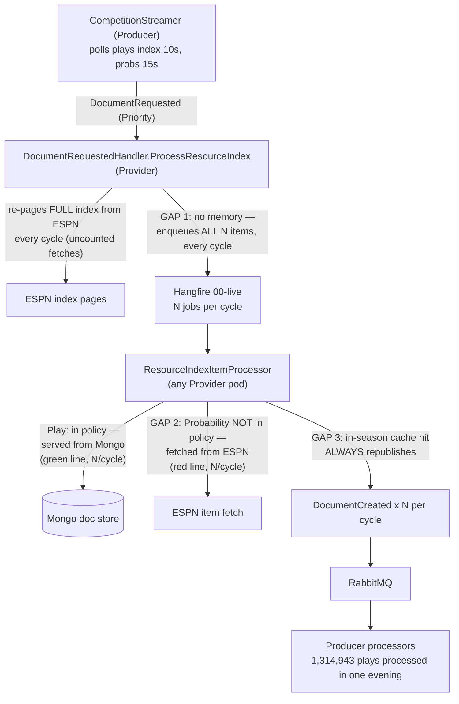
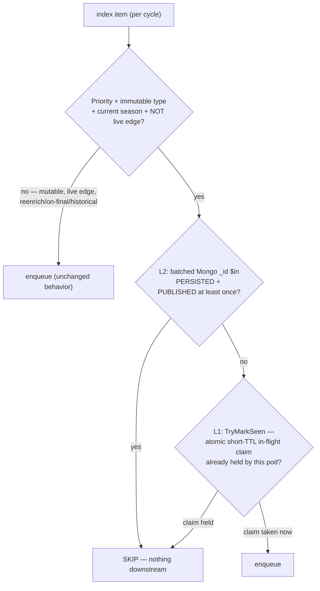

# Live Sourcing O(N) Re-Emission — Index-Level Already-Seen Skip

Status: **In review — PR #733** (branch `feat/live-sourcing-seen-skip`).
Review round 1 (Vortex + CodeRabbit) reshaped L1 into a short-TTL atomic
in-flight claim and made L2 the every-cycle durable check — see "The fix —
layered checks at the fan-out" below for the current semantics.
Last updated: 2026-09-07
Scope: live competition streaming (NCAAFB/NFL now; any streamed sport). Successor to
`docs/features/in-season-cache-bypass-fix.md` — this implements that doc's deferred
**Design option #2 ("Reduce demand at the source")**, promoted from follow-on to
required by the 2026-09-06 evidence below.

## Problem

During a live game, every polling cycle re-enqueues **every item the game has ever
produced**, not just what is new. The 2026-07 fix (#549/#551) redirected the redundant
fetches from ESPN to Mongo for `EventCompetitionPlay` — but the redundant *work* still
exists at every other stage: a Hangfire job on `00-live`, a Mongo read, a
`DocumentCreated` publish to RabbitMQ, and a full Producer processing hop, for every
already-seen item, every cycle.

### Evidence (2026-09-06 evening, 2 streamed NCAAFB games)

Grafana, per-interval counts (NOT cumulative):

- **MongoDB Cache Hits vs ESPN Live Fetches** (Provider): both series climb
  *linearly* for the duration of each game — cache hits ~500 → ~3,800/interval,
  ESPN fetches ~500 → ~1,700/interval — then drop when a game ends (~19:45, ~23:10
  sawtooth resets).
- **Documents Processed by Type** (Producer): `EventCompetitionPlay`
  **1,314,943** documents processed in one evening; `EventCompetitionProbability`
  **611,931**; `EventCompetitionDrive` 118,409. The games contained roughly
  500–600 real plays. **Amplification ≈ 2,000x.**

### Growth model

Per-interval work proportional to N (items so far) with N growing ~linearly in game
time ⇒ the chart's linear per-interval climb ⇒ **quadratic cumulative cost per game**
(≈ N²/2 fetch-units for an N-play game). A 180-play game at the 10s play cadence
(~720 cycles over 2h) costs ~720 × N/2 ≈ 65,000 pipeline traversals for plays alone.

## Root cause — three compounding gaps

`FootballCompetitionStreamer` polls per live game: plays index every **10s**,
probabilities every **15s**, drives 15s, situation 5s, leaders 60s. Each poll lands in
`DocumentRequestedHandler.ProcessResourceIndex`, which pages the entire index and
enqueues one `ProcessResourceIndexItemCommand` per item.

1. **The fan-out has no memory.** Nothing at the enqueue site knows an item was
   already sourced and published. All N items become Hangfire jobs every cycle;
   only the *fetch destination* (Mongo vs ESPN) is optimized downstream.
2. **`EventCompetitionProbability` is not in `InSeasonDocumentPolicy`.** The
   predecessor doc's *draft* classification listed it as mutable ("needs
   confirmation") and deliberately shipped the allow-list as
   `{ EventCompetitionPlay }` only. Probability items are per-play and immutable
   once the play completes — so the probabilities fan-out sends all N items to
   **ESPN** every 15s. This is the bulk of the ESPN-fetch line's linear growth.
3. **Cache hits still republish.** `ResourceIndexItemProcessor.HandleValid`: the
   unchanged-content/cooldown suppression is gated `!IsCurrentSeason(...)`
   (correct for mutable in-season docs, which must always flow), so a
   current-season cache HIT for an immutable play still publishes a full
   `DocumentCreated` → Producer processes every play once per ~10s for the rest
   of the game. This is the Producer chart's cyan line.

Additionally (smaller, uncounted): the index *pages themselves* are fetched from
ESPN with `bypassCache: true` every cycle, and page count grows with the game.
These fetches don't increment `espn.live.fetch`, so they are invisible on the
current panel.

## The pipeline, visualized

### Today — where the amplification lives

Every polling cycle (plays every 10s, probs every 15s, per live game), with N =
items the game has produced so far (~180 plays by game end):

The three gaps compound: gap 1 creates N-per-cycle work, gap 2 points most of it
at ESPN, gap 3 forwards all of it to Producer even when it lands on Mongo.

### The fix — layered checks at the fan-out

One decision point, at the enqueue site, so skipped work never exists anywhere
downstream (no Hangfire job, no Mongo read, no publish, no Producer hop):

- **L2 is the primary check** and the durable, cross-pod truth: one `$in`
  query on `_id` (primary key) per index page
  (`IDocumentStore.GetPublishedIdsAsync`) for **every** eligible non-edge hash
  — deliberately not pre-filtered by L1, so it is re-verified every cycle.
  "Seen" = "persisted AND published at least once" (`LastPublishedUtc`,
  written only after a successful `DocumentCreated` publish) — it cannot
  drift and cannot mask a failed job on either side of the Mongo insert: a
  document that never landed is simply not there, and one that landed but
  whose publish never went out has no marker; both re-enqueue as soon as the
  L1 claim lapses (minutes) and the cache-hit path republishes (which then
  writes the marker — pre-marker legacy documents converge the same way). It also *replaces* N individual per-item
  Mongo reads with one batched read. **Fails open**: on a store error the
  items simply enqueue (pre-skip behavior) — a Mongo hiccup must never stall
  live sourcing.
- **L1** (`SeenUriCache.TryMarkSeen`) is a per-pod **atomic short-TTL
  in-flight claim** (~10 min): it only bridges the window between an item's
  enqueue and its persistence, including under queue backlog. Taking the claim
  is test-and-set, so concurrent `DocumentRequested` deliveries for the same
  index cannot double-enqueue an item. A claim is never refreshed by later
  cycles (persisted items skip on L2 before reaching it), so a job that
  cleanly failed to persist — e.g. ESPN 404 → known-bad → return, no Hangfire
  retry — re-enqueues within minutes, preserving the pre-skip self-healing
  cadence. An enqueue that throws after claiming self-heals the same way. The
  live edge is never claimed: it must re-fetch every cycle, and once displaced
  its persisted copy is caught by L2.
- Together: persisted items die at L2 (any pod, restarts, KEDA scale-out);
  in-flight items die at L1 for the minutes their job needs to land.
  Effectively 100%, with failed-job masking bounded by the claim TTL.

### Why not `ResourceIndexItem` (Postgres)?

The natural-looking candidate — it carries `SourceUrlHash` — but it is
bookkeeping for *sourcing-job progress*: rows belong to a parent
`ResourceIndexJobs` row via `ResourceIndexId`. Ad-hoc live traffic has no parent
job (`ResourceIndexId == Guid.Empty`), which is why
`ResourceIndexItemProcessor.ProcessInternal` deliberately skips writing rows for
it. Using it as the seen-signal would require:

- starting to write a **Postgres row per live item** — re-adding per-item write
  load on the hottest path (the thing this fix removes), plus a schema change to
  permit parentless rows; and
- accepting that a row means "a command was created", NOT "the document
  persisted" — the same masking weakness as any seen-cache.

Mongo's `_id` is the **same hash value** (`HashProvider.GenerateHashFromUri`)
that `SourceUrlHash` carries, written only on successful persistence, in the
store the item processor already reads. The durable URL registry this table
suggests already exists — it is the document store itself, and it is more honest.

### Why not Redis?

Works (SET NX EX / MGET), cross-pod, cheap — but it is a *second* source of
truth that can drift (flush, eviction, TTL tuning, circuit-breaker fail-open)
and shares the seen-cache weakness: "marked" is not "persisted". Everything
Redis would record, Mongo already knows authoritatively at trivial cost (~10–20
batched primary-key reads/sec cluster-wide at 10 concurrent games). Reserve
Redis for if the existence check itself ever becomes hot; at these volumes it
will not.

## Fix

### Tier 1 — classify `EventCompetitionProbability` immutable-in-season

Add it to `InSeasonDocumentPolicy.ImmutableInSeasonTypes`. Rationale: ESPN emits one
probability item per play; like plays, the index is append-only and completed entries
do not change. The existing live-edge carve-out (last item, last page) keeps the
still-finalizing entry fresh. This revises the predecessor's draft classification with
production evidence: 611,931 processed/evening for ~500 real items.

Effect alone: moves the probability bleed from ESPN to Mongo (red line flattens per
cycle) — but converts it into additional cache-hit/republish churn. Tier 1 without
tier 2 just recolors the problem.

### Tier 2 — already-seen skip at the fan-out (the core fix)

In `ProcessResourceIndex`, before enqueueing an item, skip it when **all** of:

- `evt.Priority` is `true` — streamer-originated live traffic only. Manual
  reenrich, on-final contest refresh, historical sourcing, backfills, and
  dependency requests are untouched by construction.
- `InSeasonDocumentPolicy.IsImmutableInSeason(evt.DocumentType)` — mutable types
  (situation, status, score, leaders, active drives) always flow.
- `isCurrentSeason` — same gate as the existing immutable-serve carve-out.
- NOT the live edge (`dto.PageIndex >= dto.PageCount && i == last`) — the newest,
  possibly still-finalizing item keeps flowing every cycle, exactly as today.
- The document is persisted in Mongo AND has been published at least once
  (**L2**, checked first), or this pod holds a live in-flight claim for it
  (**L1** `SeenUriCache.TryMarkSeen`) —
  the cross-pod cold-L1 case is covered by L2 (see
  `L2_PersistedItems_SkippedAcrossPods_ExceptLiveEdge`).

The in-flight claim is taken **atomically at enqueue time**, in the same loop.
Claiming at enqueue (rather than marking at publish, in
`ResourceIndexItemProcessor`) is deliberate: the enqueuing consumer and the
Hangfire worker that processes the item can be different pods (Hangfire is a
shared DB-backed queue), so a mark-at-publish in-memory signal is cross-pod
broken in both directions. The claim only asserts "handed to Hangfire minutes
ago, presumed in flight" — persistence itself is what L2 verifies, every cycle.

### Seen cache (L1 claim)

Per-pod in-memory `ConcurrentDictionary<string urlHash, DateTime expiresUtc>`,
claim TTL ~10 minutes, atomic test-and-set (`TryAdd`/`TryUpdate`), pruned
opportunistically. No durable backing — durability lives at L2 (the document
store itself), so the claim's only job is the enqueue-to-persistence window.
Consequences accepted:

- **Pod restart / deploy mid-game**: nothing lost — L2 skips everything
  persisted on the very first cycle; at most the currently in-flight handful
  double-enqueues once (idempotent downstream).
- **KEDA scale-out**: same — L2 is shared truth, so a new pod does not re-walk
  persisted history; only unpersisted in-flight items can double-enqueue.
- Memory: ~360 entries/game (plays + probs). Negligible.

### Correctness analysis — what could we miss?

- **A play's job never persists** (ESPN 404 → known-bad clean return with no
  Hangfire retry, exhausted retries, enqueue failure after claiming), **or
  persists but its publish never lands** (`InsertOneAsync` succeeded, the
  `DocumentCreated` publish/outbox flush did not — Vortex round 2): L2 keys on
  the `LastPublishedUtc` marker, written only after a successful publish, so
  neither case is vouched for; the L1 claim lapses in ~10 minutes and the item
  re-enqueues — the pre-skip self-healing cadence, bounded
  by the claim TTL instead of masked for hours. Producer's dependency-request
  **leaf path** (untouched by the skip) remains an independent recovery route.
- **Mid-game ESPN corrections to old plays**: already not picked up today (the
  predecessor doc's "correction coverage — DEFERRED" gap; cached plays serve from
  Mongo and only the edge refetches). This fix does not widen that gap; the
  on-final force-bypass re-validate remains the deferred follow-on that closes it.
- **On-final contest refresh**: flows through the same handler but is not
  `Priority` streamer traffic, so the skip does not apply. Its behavior is
  unchanged (serves plays from Mongo per #549 — the deferred on-final
  force-bypass is orthogonal).
- **Live edge**: never skipped, so the finalizing item's transition is captured on
  the next cycle, exactly as today.

## Deliberately out of scope (follow-ups)

- ~~**Drives**~~ DONE 2026-09-08 after plays/probs verified in prod (233x/900x
  reductions; drives left as the #1 amplifier at 36,276/game): the active
  drive IS the live edge (newest item), so the existing carve-out covers its
  mutation window; completed drives share plays' accepted correction gap.
- **Index-page paging**: the plays index is re-paged in full from ESPN every cycle
  and grows with the game (uncounted on current panels). A "last page only after
  first full walk" optimization or a larger `limit` on the streamer's index
  request would collapse it; separate change, separate risk.
- **On-final force-bypass re-validate**: still the predecessor doc's open
  follow-on; unchanged by this work.
- **Cache-hit republish suppression for immutable types** (gap #3 directly):
  superseded for indexed items by the fan-out skip; the leaf path's republish is
  load-bearing for dependency resolution and stays.

## Testing

- Unit (`DocumentRequestedHandler`): second cycle of an identical index enqueues
  only the live edge; first cycle enqueues all; cache-missing item (evicted /
  fresh pod) enqueues; mutable type never skipped; non-Priority request never
  skipped; historical/future season never skipped; live edge never skipped.
- Unit (`InSeasonDocumentPolicy`): `EventCompetitionProbability` classified
  immutable (locks tier 1).
- Unit (seen cache): first claim wins; a second claim within the TTL is
  refused; a lapsed claim is claimable again and restarts its TTL.
- Unit (L2): published non-edge items skip with a cold L1 (the cross-pod case)
  without taking claims; the L2 query includes ALL eligible non-edge hashes
  even when their claims are held (the failed-job re-check); the live edge
  never enters the batch query and always flows; the batch is never consulted
  for non-Priority traffic; a throwing store fails open (all items enqueue,
  consumer does not fault).

## Rollout / verification

- Deploy Provider; no config, no migration, no Producer change.
- Success metrics on the next live slate (same two Grafana panels):
  - *MongoDB Cache Hits vs ESPN Live Fetches*: both series **flat** per game
    (proportional to new events + mutable-aggregate cadence), no intra-game slope.
  - *Documents Processed by Type* (Producer): `EventCompetitionPlay` and
    `EventCompetitionProbability` totals within ~2–3x of real event counts
    (edge re-fetch + per-pod rewarm), not 2,000x.
  - Hangfire `00-live` queue age percentiles stay flat through the late window.
- Risk: an immutable item whose Hangfire job never persists — or never
  publishes — is suppressed only for the L1 claim TTL (~10 min): L2 re-verifies
  the persisted+published marker every cycle, so the item re-enqueues on the
  first cycle after the claim lapses. Recovery is
  further backed by Producer's dependency-request leaf path and manual
  reenrich.

## Related

- `docs/features/in-season-cache-bypass-fix.md` — predecessor; this is its
  option #2, promoted.
- `reference_stuck_live_finalization_rate_limit` — the original symptom class.
- SUNDAY 09-06 docket item: "index-level already-seen skip (93% of live queue =
  immutable plays/probs)" — this doc is that item, with the 09-06 evening charts
  as the quantified motivation.
