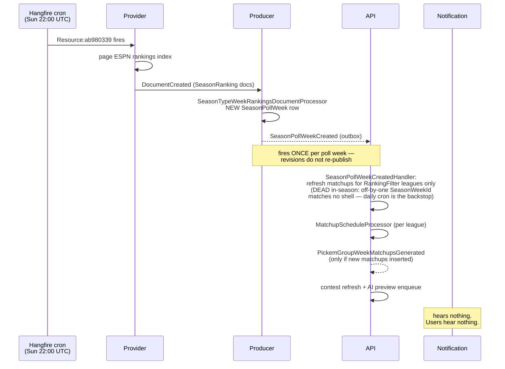
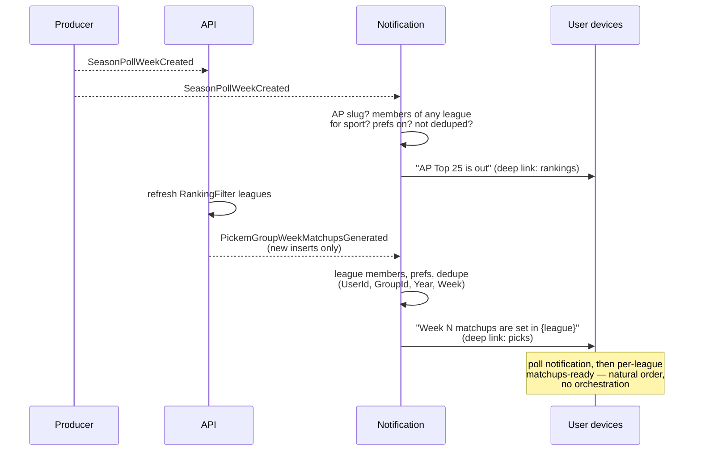
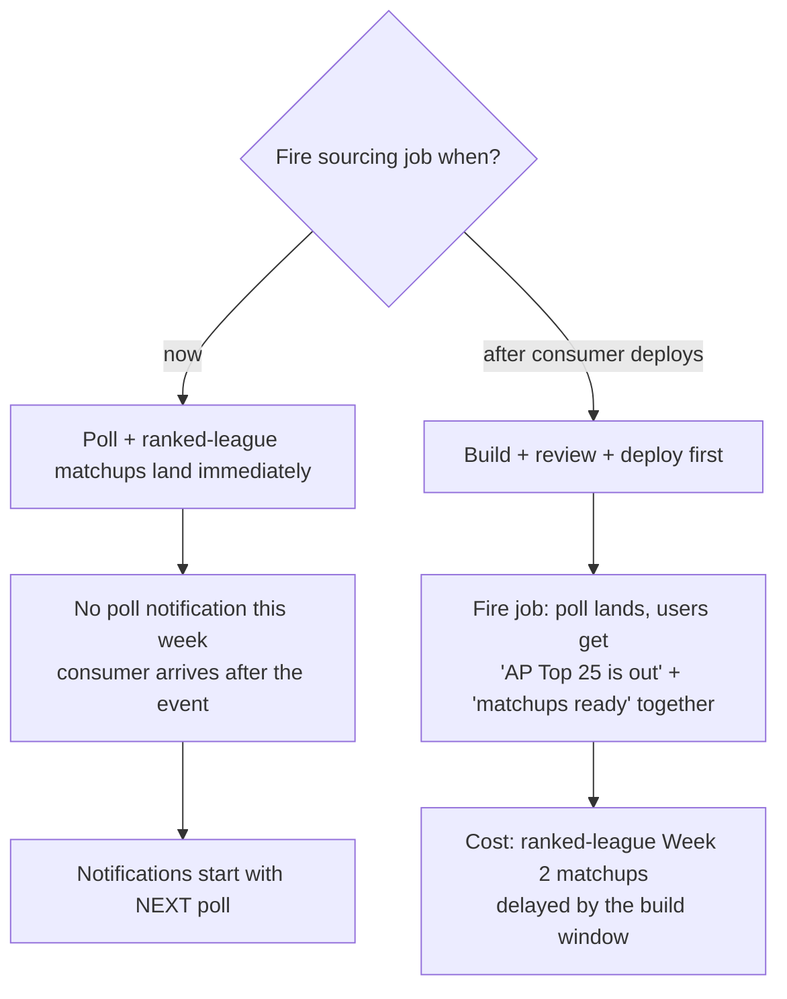

# Poll-Release & Matchups-Ready Notifications

**Status: IN REVIEW (PR #741) — local E2E COMPLETE 2026-09-08: both
notifications received on physical devices against the real Week 2 AP
poll.** Written 2026-09-08, the morning the Week 2
AP poll dropped on a Tuesday and competing apps pushed notifications while we
had nothing. This doc captures the current event plumbing (verified against
source and prod Seq logs), the plan, and the one sequencing decision the
operator must make before firing the poll-sourcing job.

## Product intent

Two push notifications, in natural order:

1. **"AP Top 25 is out"** — the moment a new AP poll is detected. This is a
   re-engagement hook competitors already exploit; poll release is one of the
   few weekly moments a casual user opens a CFB app outside game day.
2. **"Week N matchups are ready — make your picks"** — the moment a league's
   week slate is actually populated, which for ranking-filtered leagues
   happens *because of* the poll. Ordering behind #1 falls out of the existing
   event chain for free; no orchestration is needed.

## Current state (verified 2026-09-08)

### What exists

| Piece | Where | Status |
|---|---|---|
| AP poll sourcing | Recurring `ResourceIndex` row `ab980339-9958-4238-8db1-7459c556b6c7` (`…college-football.seasons.rankings`), cron `0 22 * * 0` (Sun 22:00 UTC), registered by `SourcingJobOrchestrator` as Hangfire job `Resource:{guid}` | LIVE |
| Manual re-fire | `POST admin/ops/provider/football/ncaa/resourceIndex/{id}/process` via ops proxy; `bruno/api/resourceIndex-process.yml` (id corrected 2026-09-08) | LIVE |
| Poll-detected event | `SeasonPollWeekCreated` published by `SeasonTypeWeekRankingsDocumentProcessor` (Producer), outbox-atomic with the new `SeasonPollWeek` row. Carries `SeasonPollWeekId`, `SeasonPollId`, `SeasonWeekId?` + week date bounds, `SeasonYear`, `PollSlug`, `Sport` | LIVE |
| Poll → matchup refresh | `SeasonPollWeekCreatedHandler` (API) enqueues a refresh `ScheduleGroupWeekMatchupsCommand` for every active league with a `RankingFilter` whose window overlaps the poll's week | **DEAD in-season** — the event carries the linkage defect's off-by-one `SeasonWeekId` (Week-2 poll → ESPN week 3), so the shell join matches nothing ("affects 0 leagues"; verified in E2E). Daily `MatchupScheduler` cron (`Cron.Daily(6)` — 06:00 UTC / 02:00 ET) is the working backstop. Date-based fix = deferred API follow-up |
| Matchups-ready event | `PickemGroupWeekMatchupsGenerated` published by `MatchupScheduleProcessor` **only when new matchups were inserted** and the week isn't already completed | LIVE |
| Its only consumer | `PickemGroupWeekMatchupsGeneratedHandler` (API) — contest refresh fan-out + AI preview enqueue. Nothing user-facing | LIVE |
| Push infrastructure | Notification service: `FirebasePushNotificationSender`, `UserDevice` registry, `PushDeviceFanout`, per-user `UserNotificationPreferences` toggles, `NotificationLog`, table-per-type dedupe entities, `MatchupDeepLink` | LIVE |

### What does NOT exist

- No consumer of `SeasonPollWeekCreated` in the Notification service.
- No consumer of `PickemGroupWeekMatchupsGenerated` in the Notification service.
- Therefore: no user-facing signal for either moment. The Notification
  service's current vocabulary is pick scored, pick deadline, contest start,
  odds changed, league invite/membership — all of it per-user-event driven;
  there is no broadcast-class notification yet.

### Current event flow



Conference/all-team leagues are populated by the daily `MatchupScheduler`
cron independent of polls; the poll-triggered path only *adds newly-ranked
contests* to ranking-filtered leagues.

### Known timing gap (separate, pre-existing)

The sourcing cron fires Sunday 22:00 UTC. A Monday or Tuesday poll release
(post-Labor Day Week 1, and any future slid release) is missed until the
following Sunday. The original seeded cron had the mirror-image bug (ran *before*
Sunday releases). Since index sourcing is cheap and idempotent (unchanged
docs no-op on content hash), the hedge is widening the row's cron to
`0 22 * * 0,1,2`. There is no update endpoint on `ResourceIndexController`
(create + process only), so this is a one-line SQL update on the Provider DB
or part of the unauthorized season-aware-sourcing design
(docs/features/season-aware-recurring-sourcing.md). **Not in scope for this
PR; operator decision.**

## Plan

**One PR, Notification service only. No new events, no Producer or API
changes** — both trigger events already exist and already cross the broker
(Notification consumes Producer's `ContestOddsUpdated` /
`ContestStartTimeUpdated` today, so the path is proven).

### A. "AP Top 25 is out"

- New consumer for `SeasonPollWeekCreated`, filtered to the AP poll's
  `PollSlug` (coaches poll stays silent in v1).
- **Do not gate on `SeasonWeekId`.** The known `SeasonPollWeek.SeasonWeekId`
  linkage defect (preseason poll linked to Regular week 2; some polls link
  NULL — see reference in memory / matchup-ranks PR, where all read paths
  went date-based) must not suppress the notification. Poll release is
  newsworthy regardless of week mapping.
- **Audience**: users with a notification-enabled device who are members of
  ≥1 league for the event's sport — ANY league row, deactivated leagues
  included. The Notification-side `PickemGroup` projection carries no
  active/deactivated state and neither `PickemGroupCreated` nor
  `PickemGroupDataPublished` publishes it, so an active-league filter is a
  cross-service contract change (Core event + API publisher + projection +
  backfill) — recorded as a follow-up, accepted for v1. Practical impact is
  bounded: the claim dedupes per user, so anyone also in an active league
  gets exactly one push either way; only users whose ONLY leagues are
  deactivated are over-notified. Fan out via the existing
  `PushDeviceFanout`.
- **Dedupe**: new table-per-type entity `NotificationPollRelease` keyed
  `(UserId, SeasonPollWeekId)` — same pattern as `NotificationUserPick`.
  At-least-once redelivery and any future revision re-publish are absorbed.
- **Preference**: new `UserNotificationPreferences` column (default **ON** —
  this is the re-engagement hook), migration alongside. **The per-category
  opt-out ships DARK in v1** (flagged by Vortex on PR #741): nothing writes
  the two new flags yet — the Core `UserNotificationPreferencesUpdated`
  event, API entity/command, and UI toggles all need extending, a
  cross-service follow-up PR (event fields must be nullable so old
  publishers don't stomp values). The gate + columns ship now so that
  follow-up only touches the preference chain, not these consumers. Users
  are not without recourse meanwhile: device-level opt-out is live —
  `PushDeviceFanout` honors `UserDevice.NotificationsEnabled`, so turning
  notifications off in the app/OS suppresses these like every other push.
- **Deep link**: rankings screen (shipped in the rankings-visibility arc,
  PRs #649–651).
- **Copy** (v1, static): title "AP Top 25 is out", body "The new college
  football rankings just dropped. See who moved." Movement highlights
  ("Miami up to #4") are a v2 once `SeasonPollWeek` prior-week diffing is
  available — do not block v1 on it.

### B. "Week N matchups are ready"

- New consumer for `PickemGroupWeekMatchupsGenerated`. The publisher's
  insert-gate already gives correct semantics: no event on pure-update
  refreshes, no event for already-completed weeks.
- **Audience**: members of the event's league (`NotificationMembership`).
- **Dedupe**: `(UserId, GroupId, SeasonYear, SeasonWeek)` — one notification
  per user per league-week, even though ranked-league refresh passes can
  legitimately re-fire the event when late contests are inserted mid-week.
  First insert wins; later additions stay silent in v1.
- **Preference**: second new `UserNotificationPreferences` column, default ON.
- **Copy**: "Week {N} matchups are set in {league name} — make your picks",
  deep link via existing `MatchupDeepLink` to that league's picks screen.
- **Interaction with pick-deadline reminders v2** (#727): this is the
  *opening* bookend ("slate is ready") to v2's *closing* bookend ("deadline
  approaching, you have missing picks"). No overlap, no changes to v2.

### Proposed flow



Conference-league weeks generated by the daily scheduler also emit
`PickemGroupWeekMatchupsGenerated` on first insert, so notification B covers
them too — it is not poll-dependent.

### Work items

1. `SeasonPollWeekCreatedConsumer` (Notification) + `NotificationPollRelease`
   entity + membership-scoped device fan-out.
2. `PickemGroupWeekMatchupsGeneratedConsumer` (Notification) +
   `NotificationMatchupsReady` entity.
3. Migration: two dedupe tables + two `UserNotificationPreferences` columns.
4. Copy + deep links (rankings screen; league picks via `MatchupDeepLink`).
5. Unit tests: dedupe idempotency, preference gating, AP-slug filter,
   null-`SeasonWeekId` poll still notifies, non-member exclusion — armed
   mocks per the PR #740 lesson (a test must be able to fail the guard it
   pins).
6. Deploy runbook: **pre-declare the two new consumer exchanges before
   shovel binding** (the #682 lesson) — runbook line, not code.

### As built (2026-09-08, branch `feat/poll-release-notifications`)

- `SeasonPollWeekCreatedConsumer` + `PickemGroupWeekMatchupsGeneratedConsumer`
  (Notification), registered in `Program.cs`.
- `NotificationPollRelease` (unique `(UserId, SeasonPollWeekId)`) and
  `NotificationMatchupsReady` (unique
  `(UserId, LeagueId, SeasonYear, SeasonWeek)`); migration
  `PollReleaseAndMatchupsReadyNotifications` also adds
  `PollReleasedEnabled` / `MatchupsReadyEnabled` (default true) to
  `UserNotificationPreferences`.
- `PushDeviceFanout` gained an optional FCM `data` payload passthrough
  (deep links); reminder callers are unchanged.
- AP filter matches `PollSlug == "ap"` (ESPN's `type` field, which
  `SeasonPollDocumentProcessor` stores as the slug).
- New deep-link kinds on the wire: `PollReleased` (target `rankings`) and
  `MatchupsReady` (target `picks`, with `leagueId`/`week`/`sport`). Mobile
  tap-handler support ships with the next mobile batch; until then a tap
  falls back to opening the app.
- Tests: 15 new (AP filter, null-week poll still notifies, opt-out audit
  rows, distinct-user broadcast, per-member fan-out, failure-reason
  capture). The Npgsql 23505 claim-race branch is not unit-testable on
  InMemory — same as every existing typed-claim consumer; the unique
  indexes pin the schema side.

## Local testing (step-by-step)

Prereqs: fresh prod backup restored locally (predates the Week 2 poll —
that's the point), host RabbitMQ + Postgres up.

Run the stack FROM THIS BRANCH with a rebuild — the compose file already
includes the `notification` service (added for SmackBot Lab), but a
previously-built image has neither the new consumers nor the migration
that creates the tables below:

```
docker compose -f docker-compose.local.ncaa.yml up --build
```

**⚠ REAL PUSHES FROM LOCAL (learned the hard way 2026-09-08):** the Local
App Config label DOES carry real Firebase credentials, and a restored prod
backup carries real FCM device tokens — so a local test WILL push to real
users' phones (it did: 5 users got "AP Top 25 is out" from a local run).
Before testing, either sanitize devices (`delete from "UserDevices" where
"UserId" not in (<your own user ids>)`) or blank
`CommonConfig:Firebase:ProjectId` in the Local label to engage the no-op
sender (claim rows then finalize `Failed_FcmError` "not configured" —
copy/audience/dedupe all still verifiable from the rows).

### Test 1 — poll-released (rehearses the prod fire exactly)

1. Fire the rankings sourcing against LOCAL Provider (no ops proxy locally):
   `POST http://localhost:7050/api/resourceIndex/ab980339-9958-4238-8db1-7459c556b6c7/process`
   with body `{}`.
   (7050 = compose `provider-ncaa`; use 5205 only if running Provider
   natively via `dotnet run`.)
2. Watch Producer create the new `SeasonPollWeek` row and publish
   `SeasonPollWeekCreated` (Producer log / outbox).
3. Verify in `sdNotification.All`:
   `select * from "NotificationPollReleases";`
   — one row per user who belongs to a NCAAFB league, Title
   "AP Top 25 is out".
4. Re-fire step 1. `SeasonPollWeek` already exists → no new event → no new
   rows (row count unchanged).

**If the poll was already sourced** (the event fired with no consumer
listening — it is one-shot), the reset is TWO steps, verified 2026-09-08:

1. Delete the poll's `SeasonPollWeek` row (LOCAL Producer FootballNcaa DB,
   newest by `CreatedUtc`). Re-firing the INDEX alone is NOT enough — the
   index chain only touches the 5 poll docs, and the poll doc's
   existing-entity path skips the occurrence-child requests.
2. Republish the occurrence document directly, with priority so it jumps
   any local Hangfire backlog:
   `POST http://localhost:7050/api/documents/documentRequest` with
   `{"id":"<guid>","uri":"http://sports.core.api.espn.com/v2/sports/football/leagues/college-football/seasons/{year}/types/2/weeks/{week}/rankings/1?lang=en&region=us","sport":2,"seasonYear":{year},"documentType":36,"sourceDataProvider":0,"correlationId":"<guid>","causationId":"<guid>","priority":true}`
   (numeric enums — Provider has no string-enum converter; `priority`
   routes the Producer job to the live queue).

Producer takes the new-entity path and re-publishes `SeasonPollWeekCreated`.

### Test 2 — matchups-ready

1. Create a new NCAAFB league (web or API) with a couple of members, or
   re-fire matchup generation for an existing league week.
2. When `MatchupScheduleProcessor` inserts the week's matchups it publishes
   `PickemGroupWeekMatchupsGenerated`.
3. Verify in `sdNotification.All`:
   `select * from "NotificationMatchupsReady";` (singular by design —
   "MatchupsReadies" was not going to live in prod)
   — one row per member, Body "Week {N} matchups are set in {league} —
   make your picks."
4. Re-fire generation for the same week → event may re-publish, but row
   count must NOT change (unique `(UserId, LeagueId, SeasonYear,
   SeasonWeek)` claim absorbs it).

### Ordering (corrected after E2E — the "free" check is NOT free)

As designed, a poll fire on a `RankingFilter` league would produce both
notifications in order. In practice the poll → refresh leg is DEAD for
in-season polls (off-by-one `SeasonWeekId`, see the current-state table),
so Test 1 alone yields NO `NotificationMatchupsReady` rows — that is the
dead fast path, not a broken notification B. Matchups-ready rows come
from running `MatchupScheduler` directly (Test 2), exactly as the
2026-09-08 E2E did. Until the date-based handler fix ships, production
gets the same ordering only by manually triggering `MatchupScheduler`
(jobs.sportdeets.com) right after the poll fire; otherwise the slate — and
notification B — waits for the daily 06:00 UTC (02:00 ET) cron.

## Sequencing decision (operator)

`SeasonPollWeekCreated` fires once, on first sight of the poll. Firing the
sourcing job before the consumer is deployed means this week's poll produces
no notification, ever — there is no event left to consume.



Recommendation: **hold and build.** The build is small, and ranked-league
Week 2 matchups are gated on this poll either way. Landing the poll, the
refreshed slate, and both notifications in the same moment is the product
beat this feature exists for — but note it takes TWO operator actions
until the date-based handler fix ships: fire the poll sourcing, then
trigger `MatchupScheduler` manually (the dead fast path cannot chain them).

## Out of scope (recorded, not planned here)

- Cron widening for Monday/Tuesday poll releases (operator SQL or the
  season-aware-sourcing design doc).
- Poll revision handling (`SeasonPollWeekCreated` on revisions) — existing
  deferred item.
- Movement-aware notification copy (needs prior-week diffing).
- Coaches poll / CFP rankings notifications (CFP hidden until November per
  rankings-visibility arc).
- In-app poll visibility beyond the existing rankings screens.
