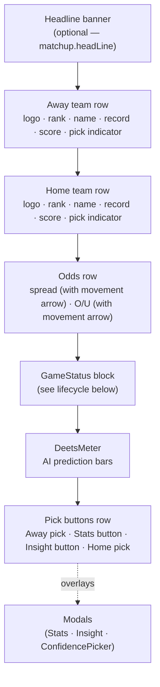
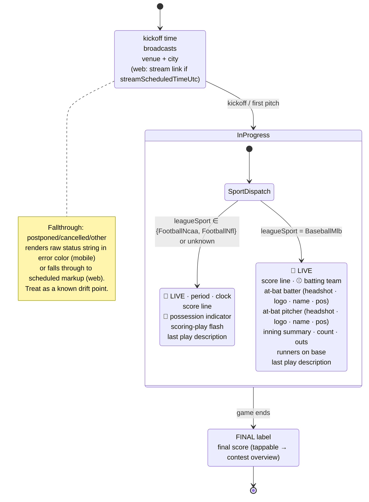

# MatchupCard blueprint

The canonical structure for the `MatchupCard` component across web (sd-ui)
and mobile (sd-mobile). Both platforms should render the same slot
stack, the same state-driven presentation, and the same GameStatus
dispatch. Drift between platforms is corrected against this document.

This is the **card itself + GameStatus dispatch**. Modals (Stats
comparison, Insight preview, Confidence picker) are treated as black
boxes — they have their own contracts and surfaces that this doc
references but does not specify.

---

## Slot layout (default structure)

The slot model below is the **default** — what every MatchupCard
renders at minimum, in the order shown. Most state transitions affect
the *content and presentation* of individual slots rather than the
structure.



Two ways the rendered structure can deviate from the default:

1. **Headline banner is always optional** — rendered only when
   `matchup.headLine` is present.
2. **A platform may reorganize slots for a specific state** when it
   suits the surface. Mobile's Scheduled state uses a 2-column compact
   layout that fuses the OddsRow + the Scheduled-branch content of
   GameStatus into a right-column `ScheduledMeta` block alongside the
   team rows on the left (see the `isScheduled` branch in mobile's
   `MatchupCard.tsx`). This is acceptable *platform expression* of the
   same underlying contract: data and lifecycle are unchanged; only
   the spatial arrangement adapts. When such a reorganization is
   intentional, document it here; when it's drift between platforms,
   file it in the "Known drift" section.

Sub-elements inside a slot may also be conditional — e.g. the rank
prefix on team rows only renders when `awayRank`/`homeRank` is
non-null.

---

## GameStatus lifecycle

The GameStatus block is the only slot whose entire content is driven
by `matchup.status`. Three primary states, plus a fallthrough for
postponed/cancelled/etc. InProgress dispatches further by `leagueSport`.



**Sport dispatch is by `leagueSport` (backend Sport enum name)**, not by
inspecting the matchup payload. Today: `FootballNcaa` / `FootballNfl`
both render the football block; `BaseballMlb` renders the baseball
block; any unknown/missing value falls back to football. This default
exists for backwards compatibility with callers that haven't threaded
the prop through yet — new sports should be added as explicit branches.

---

## State-driven presentation matrix

The invariant slots above change their *presentation* (border colors,
glyphs, dim states, lock indicators) based on a small set of derived
flags. The flags are derived from `matchup.status` + the user's pick
record; the table below is the source of truth for which slot reacts
to which flag.

| Derived state                         | Card border       | Team rows                                | Pick buttons             |
| ------------------------------------- | ----------------- | ---------------------------------------- | ------------------------ |
| Scheduled · unlocked                  | neutral           | both active                              | tappable                 |
| Scheduled · locked (≤5 min pre-game)  | neutral           | both active                              | 🔒 lock icon, unpickable |
| InProgress                            | neutral           | live scores; loser dims as gap grows     | 🔒 lock icon, unpickable |
| Final · pick correct                  | **green**         | losing team dimmed                       | ✓ on picked team         |
| Final · pick incorrect                | **red**           | losing team dimmed                       | ✗ on picked team         |
| Final · no pick made (missed)         | **red**           | losing team dimmed                       | 🔒 on both (missed)      |
| Read-only user (any state)            | per above         | per above                                | 🔒 lock icon, unpickable |

**Derivation rules** (single source for both platforms):

- `isFinal` = `status ∈ {Final, Completed}` (case-insensitive)
- `isLocked` = `isFinal` OR `status ∈ {InProgress, Ongoing, Halftime}` OR `(kickoff - now) ≤ 5min` OR `user.isReadOnly`
- `hasPick` = a pick row exists for this contest + user
- `isPickCorrect` = on Final only; from the server-calculated `userPickResult.isCorrect`. **Never client-computed.**

The read-only check is currently a web-only path (`usePickLocking`
checks `userDto.isReadOnly`); mobile's lock function does not consult
the user. **Drift.**

---

## Modals (referenced, not specified here)

Three modals are owned by MatchupCard. They have their own contracts;
this doc only specifies *when* they open from the card.

| Modal              | Trigger                                      | Notes                                                  |
| ------------------ | -------------------------------------------- | ------------------------------------------------------ |
| Stats comparison   | `📋` button in pick row                      | Lazy-loads team stats + metrics on first open          |
| Insight preview    | `📈` button (or 🔒 when locked) in pick row  | Disabled when `!matchup.isPreviewAvailable`            |
| Confidence picker  | Tap a team's pick button in a CP league      | **Web only today.** Mobile has no confidence path yet. |

---

## Data contract (input)

Every MatchupCard consumes one `Matchup` (or `LeagueWeekMatchup`) shape
plus an optional `UserPick`. The fields the card needs are below; the
canonical wire types live in `LeagueWeekMatchupsDto` (server) and are
mirrored in `src/types/models` (mobile) and the props of `MatchupCard.jsx`
(web).

Required for all states:

```text
contestId, status, startDateUtc,
home, homeShort, homeSlug, homeLogoUri, homeFranchiseSeasonId,
away, awayShort, awaySlug, awayLogoUri, awayFranchiseSeasonId
```

Required when present (state-conditional):

```text
headLine                                            // headline banner
homeRank, awayRank                                  // rank prefixes
homeWins, homeLosses, awayWins, awayLosses          // records
homeConferenceWins, homeConferenceLosses, ...       // conference records
homeScore, awayScore                                // InProgress + Final
spreadCurrent, spreadOpen, overUnderCurrent, overUnderOpen  // odds row
broadcasts, venue, venueCity, venueState            // Scheduled
streamScheduledTimeUtc                              // Scheduled stream link (web)
isPreviewAvailable, isPreviewReviewed               // insight button state
aiWinnerFranchiseSeasonId                           // AI pick indicator
homeLogoUriDark, awayLogoUriDark                    // dark-theme logo variants (web)
```

InProgress football fields:

```text
period, clock,
possessionFranchiseSeasonId, isScoringPlay, ballOnYardLine,
lastPlayDescription
```

InProgress baseball fields:

```text
inning, halfInning,
balls, strikes, outs,
runnerOnFirst, runnerOnSecond, runnerOnThird,
atBatShortName, atBatPositionAbbreviation, atBatHeadshotUrl,
pitchingShortName, pitchingPositionAbbreviation, pitchingHeadshotUrl,
lastPlayDescription
```

Live updates flow in over SignalR via `ContestUpdatesContext` (web) /
`contestUpdatesStore` (mobile). Both platforms merge live fields over
the REST payload with nullish fallback — a partial update never
undefines a previously-populated field.

---

## Known drift

Drift that this blueprint flags for correction. Each item should
become its own follow-up — don't bundle these into one mega-PR.

### Resolved in Round 1 (PR #337, 2026-05-19)

- **Probable pitcher row** — mobile TeamRow now renders the row from
  `matchup.{home,away}ProbablePitcher` on MLB matchups, matching web.
- **Insight icon parity** — mobile now always shows 📈, dimmed +
  disabled when no preview is available, matching web's effective
  behavior (the `isInsightUnlocked` subscription path is dead code
  hardcoded `true`).
- **Contest Overview affordance** — replaces the prior hidden
  tap-the-whole-status-block pattern with an explicit `OverviewLink`
  component (chevron + state-specific label in `theme.tint`):
  `Game Preview ›` (Scheduled), `Live Box Score ›` (InProgress),
  `Box Score ›` (Final). Documented in `GameStatus.tsx` and used by
  both `GameStatus` and mobile's `ScheduledMeta`.
- **Compact 2-column Scheduled layout (mobile)** — new platform
  expression, not a drift fix. Documented in the slot layout section
  above.

### Resolved in Round 2 (2026-05-19)

- **`userDto.isReadOnly` in lock check** — mobile `MatchupCard` now
  calls `useCurrentUser` and ORs `me?.isReadOnly` into the lock
  computation. Read-only viewers can no longer tap pick buttons.

### Mobile is missing

1. **DeetsMeter / AI prediction bars** — web renders the meters inside
   the card; mobile omits the slot entirely.
2. **ConfidencePicker integration** — confidence-points leagues work
   on web; mobile has no path to set a confidence score.
3. **TeamRow expandable schedule** — web's TeamRow opens a per-team
   schedule on tap via `useTeamSchedule`; mobile's TeamRow has no
   equivalent.
4. **Postponed/cancelled handling** — mobile shows the raw status
   string in error color; web falls through to Scheduled markup.
   Either is defensible — pick one and apply on both.

### Cross-cutting

5. **Icon library divergence** — web uses `react-icons` (FaChartLine,
   FaLock, FaClipboardList); mobile uses emoji (📈, 🔒, 📋). Acceptable
   as long as we acknowledge it — the alternative (RN vector icons)
   is a bigger lift. Document the decision; don't churn it.
6. **Dark-mode logo variants** — both platforms have access to
   `homeLogoUriDark`/`awayLogoUriDark`; web swaps via `useTheme()`;
   mobile uses the default URI in both schemes. Mobile gap.

### Server-side

7. **Headline banner population** — `matchup.headLine` is the
   blueprint slot; we should confirm the server populates this
   consistently across all sports + states. (Today it appears only
   for some marquee games.)

### Out of scope (won't fix)

- **Stream-scheduled "View" link** — web's webcam icon link tied to
  `streamScheduledTimeUtc` was originally a developer affordance for
  verifying the competition broadcasting scheduler picked up a game.
  Not a real end-user feature. The mobile-side equivalent (general
  navigation to Contest Overview from Scheduled state) is now covered
  by the new `Game Preview ›` link via `OverviewLink`. Web may
  eventually consolidate by replacing the webcam-icon-only link with
  the same `OverviewLink`-style affordance, but that's a web cleanup,
  not blueprint drift.

---

## How to use this document

- **Before changing MatchupCard on either platform**: read the slot
  layout + state matrix sections to confirm the change preserves the
  contract.
- **When adding a new state or sport-specific InProgress UI**: extend
  the lifecycle diagram first, then implement.
- **When you spot drift between platforms**: add it to the "Known
  drift" section before fixing — that converts a one-off into a
  trackable line item.
- **Don't add per-platform-only features without flagging them here**.
  If web grows a new card slot, this document and mobile both need
  follow-up. Same for mobile.

The blueprint outlives any individual implementation. If we ever spin
up a third client (e.g. a TV/wallboard renderer for the Command Center
vision), it consumes this document — not the existing implementations.
